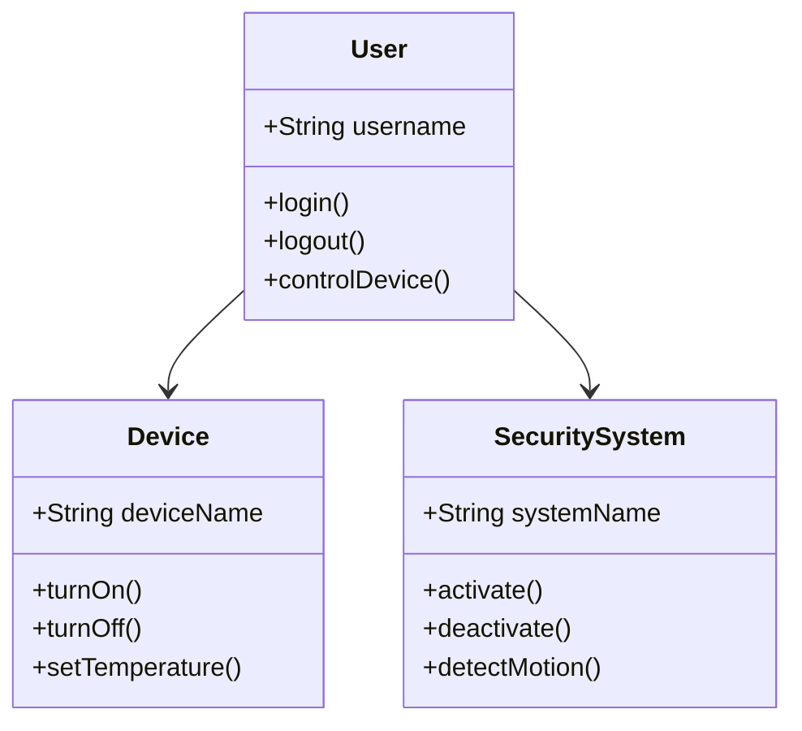
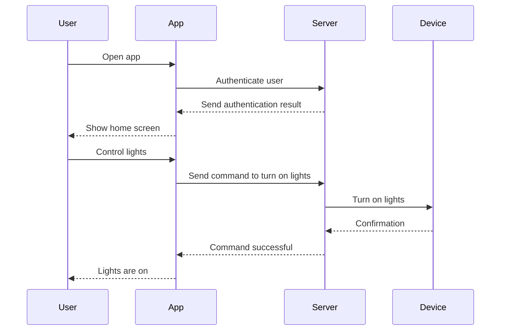
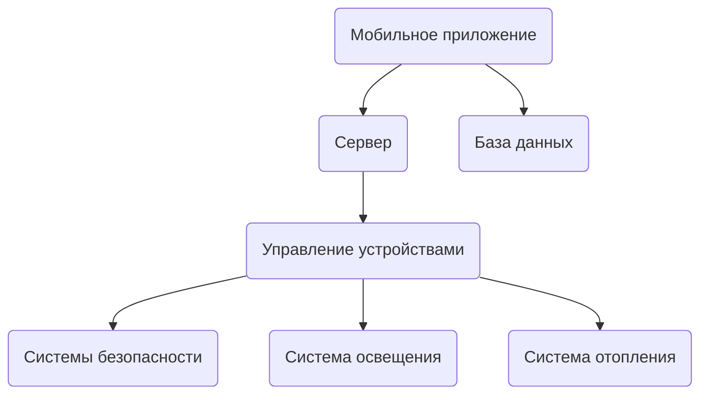

---

# Salimovsdfgsdfsdf

# Умный Дом

**Умный Дом** — это программный продукт, который позволяет пользователям управлять своим домом с помощью мобильного приложения. Он включает управление освещением, отоплением, безопасностью и бытовой техникой.

## Функциональные возможности
- Управление освещением
- Настройка температурного режима
- Система безопасности (датчики движения, камеры)
- Удалённый доступ через приложение

## UML Диаграммы

### 1. Диаграмма классов (Class Diagram)

**classUser** Отвечает за управление и взаимодействие пользователя с другими элементами системы.

**classDevice** Отвечает за представление и управление устройствами, которыми может управлять пользователь.

**classSecuritySystem** Отвечает за представление и управление системой безопасности, которой может управлять пользователь

### 2. Диаграмма последовательностей (Sequence Diagram)

 - Описывает взаимодействие между различными объектами или участниками в системе во времени.
 - Показывает, как объекты или участники обмениваются сообщениями и в каком порядке. 
 - Помогает понять логику и поток выполнения в системе.
   
### 3. Диаграмма компонентов (Component Diagram)

## Архитектура
Система сделана с использованием архитектуры клиент-сервер. Клиент выполняется на мобильных устройствах, а сервер отвечает за обработку данных и управление устройствами.

## Технологии
- Язык программирования: JavaScript
- Фреймворк: React Native
- База данных: MongoDB
- Сервер: Node.js
---
